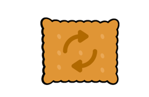

# P8 Creez une plateforme pour amateurs de Nutella

 
## Introduction 

    La startup Pur Beurre, avec laquelle vous avez déjà travaillé,  
    souhaite développer une plateforme web à destination de ses clients.  
    Ce site permettra à quiconque de trouver un substitut sain à un aliment  
    considéré comme "Trop gras, trop sucré, trop salé"  
    
## Cahier des charges 
Le cahier des charges est disponible en cliquant sur [ce lien](Cahier_des_charges.pdf)  

## Fonctionnalités et Contraintes
Voici la liste des fonctionnalités :  
    
    - En cours d'étude
 
Voici la liste des contraintes majeures :  

    - Tests : testez votre projet en adoptant la démarche qui vous semble la plus appropriée (TDD ou tests écrits à la fin d’une fonctionnalité)
    - Utilisez une base de données PostgreSql et non MySQL sous peine de ne pas pouvoir déployer votre application sur Heroku.
    - Incluez une page “Mentions Légales” qui contiendra les coordonnées de l’hébergeur ainsi que les auteurs des différentes ressources libres utilisées (template, photos, icônes, …).
    - Suivez les bonnes pratiques de la PEP 8
    - Pushez votre code régulièrement sur Github et créez des PR quand vous souhaitez avoir le retour de votre mentor.
    - Votre code doit être intégralement écrit en anglais : fonctions, commentaires, …
    - Utilisez une méthodologie de projet agile pour travailler en mode projet.

## Conception
Le projet est conçu et réalisé selon une méthodologie agile.  
Il se compose de deux parties principales :  

    - Le Front-End
    - Le Back-End

Toutes les étapes du projet sont disponibles sur ce [Trello](https://trello.com/invite/b/YnrxAILd/7a2d98453860a05769cb8752e302cc2f/p8creezuneplateformepouramateursdenutella)  
### Front-End  

    - En cours d'étude
    
### Back-End  

    - En cours d'étude
    
## Réalisation

    - En cours d'étude
    
## Production

    - En cours d'étude
    
### Installation  

    - En cours d'étude
    
### Utilisation  

    - En cours d'étude
    

## Versions  

    - En cours d'étude
    - Langage programmation : Python 3.9.0
    - Framework : Django 3.1.2
    - Base de données : PostgreSql 13
    

## Rappel des liens  

[Trello](https://trello.com/invite/b/YnrxAILd/7a2d98453860a05769cb8752e302cc2f/p8creezuneplateformepouramateursdenutella)  
[Heroku](https://www.heroku.com/what)  
[GitHub](https://github.com/StephenAOGOLO/P8_Creez_une_plateforme_pour_amateurs_de_Nutella.git)    

## Auteur  
Stephen A.OGOLO

## Remerciements  
Merci pour cette lecture et pour l'attention portée à ces informations.  
Bonne utilisation ;)  
